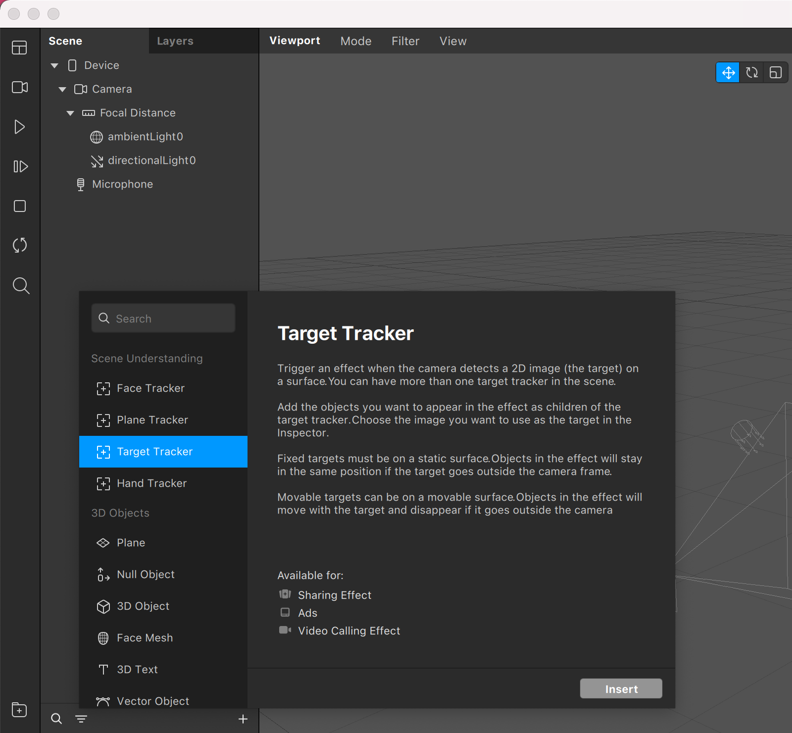
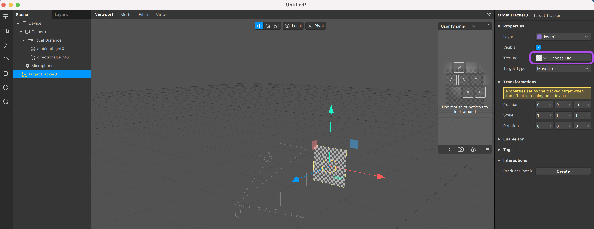
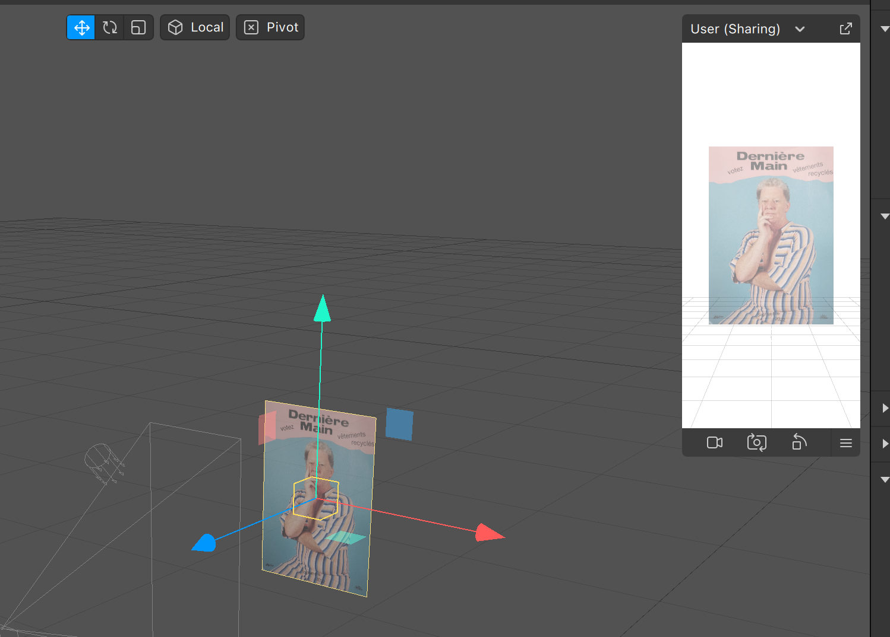
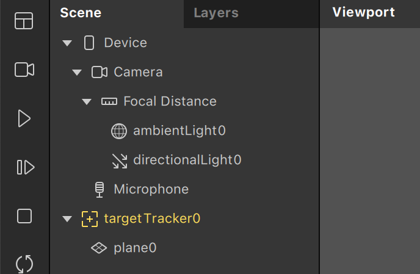
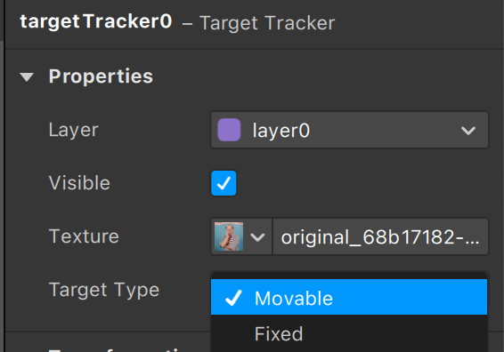

# 🚧 Spark_TargetTracker_2spi 🚧

**Ou comment créer rapidement un filtre Spark en réalité augmentée avec un Target Tracker.**

## Les ressources Spark

-> [Mettre en place un target tracking](https://sparkar.facebook.com/ar-studio/learn/articles/world-effects/target-tracker)

Ajouter le Target Tracker.

Dans les paramètres du Target Tracker, ajouter une texture qui sera l'image trackée.

Pour ajouter un élement lié à l'image trackée, il faut le drag and drop par dessus le Target Tracker pour le mettre dedans.

Ici le `plane0` n'apparaît donc que quand l'image trackée est detéctée.

Dans les paramètres du Target Tracker, on peux choisir que la target est `Movable` ou `Fixed`. 

Pour une target `Movable`, en mouvement, l'effet suit l'image trackée lorsqu'elle se déplace sur l'écran.
Pour une target `Fixed`, statique, l'effet apparaît à l'endroit où l'image trackée a été détectée.

<!--Faire des gifs. -->